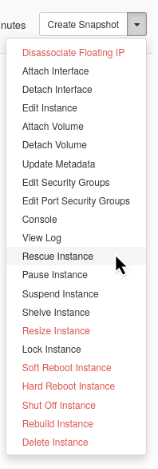

# Anleitung: Virtuelle Maschine retten

Diese Anleitung erklärt, wie Sie eine virtuelle Maschine retten können, wenn Sie keinen normalen Zugriff darauf haben. Der VM-Rescue-Modus ermöglicht es Ihnen, Ihre VM von einem temporären Rescue-Image zu starten, um Probleme wie verlorene Passwörter, Systemfehler oder Konfigurationsprobleme zu beheben.

## Wann sollten Sie VM Rescue verwenden?

Verwenden Sie VM Rescue, wenn Sie folgende Probleme haben:

- Verlorene oder vergessene Anmeldedaten
- Systemkonfigurationsfehler, die den Zugriff verhindern
- Boot-Probleme nach System-Updates
- Unbeabsichtigte Änderungen, die die VM unerreichbar machen

## Voraussetzungen

Bevor Sie mit dem Rescue-Prozess beginnen, stellen Sie sicher, dass Sie folgende Voraussetzungen erfüllen:

- Zugriff auf Ihr OpenStack-Projekt mit den erforderlichen Berechtigungen
- Grundkenntnisse der Linux-Kommandozeile (für Fehlerbehebungsaufgaben)

**Wichtige Hinweise:**

- Während sich eine VM im Rescue-Modus befindet, erlaubt das Operations Center keine Projektänderungen. Schließen Sie den Rescue-Prozess ab, bevor Sie weitere Änderungen am Projekt vornehmen
- Verwenden Sie immer nur getestete Rescue-Images, um Komplikationen zu vermeiden

## Methode 1: Verwendung des Horizon Dashboards

Befolgen Sie diese Schritte, um Ihre VM über die Web-Oberfläche zu retten:

### Schritt 1: Auf Ihre Instanzen zugreifen

1. Melden Sie sich im Horizon Dashboard an
2. Navigieren Sie zu **Project** → **Compute** → **Instances**
3. Finden Sie Ihre VM in der Instanzenliste


### Schritt 2: Rescue-Prozess starten

1. Klicken Sie auf den Dropdown-Pfeil neben dem Namen Ihrer VM in der **Actions**-Spalte
2. Wählen Sie **Rescue Instance** aus dem Menü



**Erwartetes Ergebnis:** Ein Rescue-Dialog-Fenster wird erscheinen.

### Schritt 3: Rescue-Image auswählen

1. Wählen Sie im Rescue-Dialog das **rescue**-Image aus dem Dropdown-Menü
2. **Wichtig:** Verwenden Sie nur getestete Rescue-Images, um Fehler zu vermeiden
3. Klicken Sie **Rescue Instance** zur Bestätigung


**Erwartetes Ergebnis:** Ihre VM wird in den Rescue-Modus neu gestartet. Dieser Vorgang dauert 1-2 Minuten.

### Schritt 4: Auf die Rescue-Umgebung zugreifen

Sobald Ihre VM im Rescue-Modus ist, haben Sie zwei Optionen:

#### Option A: Konsole verwenden

1. Klicken Sie auf den Namen der Instanz und wählen Sie den **Console**-Tab
2. Sie sehen die Rescue-Umgebung mit Ihrer ursprünglichen Festplatte
3. In der Konsole sehen Sie das neu generierte Passwort für den Benutzer `ubuntu`. Das Passwort kann für den SSH-Login verwendet werden


#### Option B: SSH-Zugriff

1. Verwenden Sie SSH, um sich über die Floating-IP-Adresse Ihrer VM zu verbinden
2. Verwenden Sie den Benutzer `ubuntu` und das neu generierte Passwort (siehe oben)
3. Optional: Der vom Operations Center erstellte `operation`-Benutzer ist ebenfalls verfügbar mit dem Instanz-Passwort oder SSH-Schlüsseln wie gewohnt

**Hinweis:** Die ursprüngliche VM-Festplatte wird standardmäßig nicht gemountet, normalerweise ist `/dev/vda` verfügbar (die letzte Festplatte in der Rescue-Umgebung ist das Rescue-Image).

### Schritt 5: Reparaturen durchführen

1. Mounten Sie Ihre ursprüngliche Festplatte bei Bedarf: `mount /dev/vda1 /mnt`
2. Führen Sie notwendige Fehlerbehebungs- oder Wiederherstellungsaufgaben durch
3. Nehmen Sie erforderliche Änderungen zur Problemlösung vor
4. Unmounten Sie die Festplatte, wenn Sie fertig sind: `umount /mnt`

### Schritt 6: Rescue-Modus beenden

1. Kehren Sie zur Instances-Seite in Horizon zurück
2. Klicken Sie auf das **Actions**-Dropdown für Ihre VM
3. Wählen Sie **Unrescue Instance**
4. Warten Sie, bis die VM in den normalen Modus neu startet

**Erwartetes Ergebnis:** Ihre VM kehrt mit Ihren angewendeten Korrekturen in den normalen Betrieb zurück.

## Methode 2: Verwendung der OpenStack CLI

Für fortgeschrittene Benutzer, die den Kommandozeilen-Zugang bevorzugen:

### Schritt 1: Umgebung vorbereiten

1. Stellen Sie sicher, dass die OpenStack CLI installiert und konfiguriert ist
2. Laden Sie Ihre OpenStack-Anmeldedaten
3. Überprüfen Sie den Zugriff auf Ihr Projekt

### Schritt 2: CLI-Rescue-Prozess starten

Ersetzen Sie `<server_id>` durch die ID Ihrer VM:

```bash
openstack server rescue --image "rescue" <server_id>
```

**Erwartetes Ergebnis:** Der Befehl gibt eine Bestätigung zurück, dass der Rescue-Prozess gestartet wurde.

### Schritt 3: Auf die CLI-Rescue-Umgebung zugreifen

#### Option A: Konsolen-Zugriff erhalten

```bash
openstack console url show <server_id>
```

#### Option B: Über SSH verbinden

1. Überprüfen Sie die IP-Adresse Ihres Servers:

```bash
openstack server show <server_id>
```

2. Verbinden Sie sich per SSH:

```bash
ssh ubuntu@<floating_ip_address>
```

### Schritt 4: CLI-Reparaturen durchführen

1. Ihre ursprüngliche Festplatte ist unter `/dev/vda` verfügbar
2. Mounten Sie sie bei Bedarf: `mount /dev/vda1 /mnt`
3. Führen Sie notwendige Reparaturen durch
4. Unmounten Sie sie, wenn Sie fertig sind: `umount /mnt`

### Schritt 5: CLI-Rescue-Modus beenden

Versetzen Sie Ihre VM zurück in den normalen Betrieb:

```bash
openstack server unrescue <server_id>
```

**Erwartetes Ergebnis:** Ihre VM wird mit Ihren angewendeten Korrekturen in den normalen Modus neu gestartet.

## Fehlerbehebung

### Häufige Probleme und Lösungen

#### Problem: "Driver Error: The instance is in error state after rescue"

**Symptome:**

- Fehlermeldung erscheint in den Instanzdetails: "Instance cannot be rescued: Driver Error: internal error: process exited while connecting to monitor"
- VM wechselt während des Rescue in den Fehlerzustand

**Ursache:**
Dem Rescue-Image fehlen erforderliche Eigenschaften (`hw_rescue_device=disk` und `hw_rescue_bus=virtio`).

**Lösung:**

1. Verwenden Sie nur getestete Rescue-Images, die im System bereitgestellt werden
2. Bei Verwendung eines benutzerdefinierten Images stellen Sie sicher, dass es die erforderlichen Eigenschaften hat
3. Wiederholen Sie den Rescue-Prozess mit einem gültigen Rescue-Image

**Falls das Problem weiterhin besteht:**

- Der Unrescue-Befehl könnte fehlschlagen und die VM in den Fehlerzustand versetzen
- Öffnen Sie ein Helpdesk-Ticket mit detaillierten Informationen über das Geschehene
- Unser Support-Team kann möglicherweise die Instanz auf Storage-Ebene wiederherstellen

#### Problem: Kann keine Verbindung zur geretteten VM herstellen

**Symptome:**

- Kein Zugriff auf die Rescue-Konsole
- SSH-Verbindung schlägt fehl
- Keine Antwort von der VM

**Lösungen:**

1. **VM-Status überprüfen:** Stellen Sie sicher, dass die VM vollständig im Rescue-Modus ist (Status zeigt "RESCUE")
2. **Auf Boot-Abschluss warten:** Lassen Sie 2-3 Minuten für das vollständige Laden der Rescue-Umgebung zu
3. **Netzwerkzugriff überprüfen:** Bestätigen Sie, dass eine Floating-IP zugewiesen und erreichbar ist
4. **Konsolen-Zugriff verwenden:** Versuchen Sie die Horizon-Konsole, wenn SSH fehlschlägt

#### Problem: Ursprüngliche Festplatte in Rescue-Umgebung nicht auffindbar

**Symptome:**

- Erwartete Festplatte `/dev/vda` ist nicht sichtbar
- Ursprüngliches Dateisystem kann nicht gemountet werden

**Lösungen:**

1. **Alle Festplatten auflisten:** Führen Sie `lsblk` oder `fdisk -l` aus, um alle verfügbaren Festplatten zu sehen
2. **Verschiedene Gerätenamen prüfen:** Suchen Sie nach `/dev/vdc`, `/dev/xvdb` oder ähnlichen
3. **Festplatten-Anhang überprüfen:** Prüfen Sie, ob die ursprüngliche Festplatte ordnungsgemäß im Rescue-Modus angehängt ist

### Häufig gestellte Fragen

#### Welche Anmeldedaten soll ich im Rescue-Modus verwenden?

Sie können dieselben Benutzernamen, Passwörter oder SSH-Schlüssel wie bei Ihrer ursprünglichen VM verwenden. Die Rescue-Umgebung wendet dieselben Authentifizierungseinstellungen wie Ihre ursprüngliche Instanz an.

Das Rescue-Image generiert beim Start ein neues Passwort für den `ubuntu`-Benutzer. Das Passwort ist in der Konsole sichtbar.

#### Wie lange dauert der Rescue-Prozess?

- **Rescue-Modus starten:** 1-2 Minuten
- **Fehlerbehebungszeit:** Variiert je nach Problem
- **Rescue-Modus beenden:** 1-2 Minuten

#### Kann ich auf Dateien von meiner ursprünglichen VM zugreifen?

Ja, die Festplatte Ihrer ursprünglichen VM ist in der Rescue-Umgebung verfügbar, normalerweise als `/dev/vda`. Sie können diese Festplatte mounten, um auf Dateien Ihres ursprünglichen Systems zuzugreifen und sie zu ändern.

#### Was passiert mit meinen Daten während des Rescue?

Ihre ursprünglichen Daten bleiben sicher und unverändert. Der Rescue-Prozess ändert nur die Art, wie Ihre VM startet – er modifiziert nicht Ihre ursprüngliche Festplatte oder Daten.

## Zusätzliche Informationen

**Sicherheitsüberlegungen:**

- Nur autorisierte Benutzer mit Projektzugriff können Rescue-Operationen starten
- Alle normalen Zugangskontrollen und Protokollierungen bleiben während des Rescue aktiv
- Schließen Sie Rescue-Operationen schnell ab, um die normale Sicherheitslage wiederherzustellen
