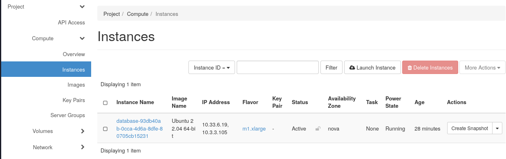
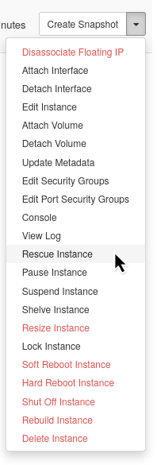
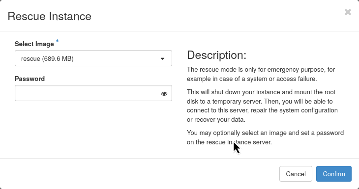
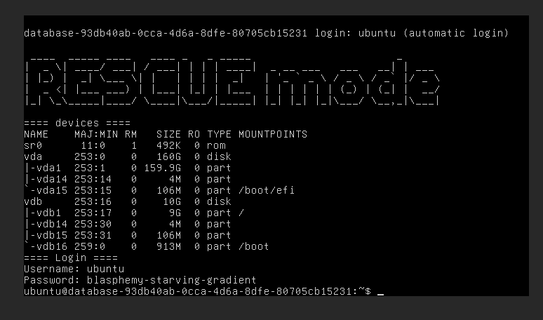

# How To Rescue a Virtual Machine

This guide explains how to rescue a virtual machine when you cannot access it normally. VM rescue allows you to boot your VM from a temporary rescue image to fix problems like lost passwords, system corruption, or configuration errors.

## When To Use VM Rescue

Use VM rescue when you experience:

- Lost or forgotten login credentials
- System configuration errors preventing access
- Boot problems after system updates
- Accidental changes that make the VM unreachable

## Prerequisites

Before starting the rescue process, ensure you have:

- Access to your OpenStack project with the necessary permissions
- Basic understanding of Linux command line (for troubleshooting tasks)

**Important Notes:**

- While a VM is in rescue mode, the Operations Center will not allow project changes. Complete the rescue process before making other modifications to your project
- Always use tested rescue images to avoid complications

## Method 1: Using the Horizon Dashboard

Follow these steps to rescue your VM through the web interface:

### Step 1: Access Your Instances

1. Log in to the Horizon dashboard
2. Navigate to **Project** → **Compute** → **Instances**
3. Find your VM in the instances list



### Step 2: Start the Rescue Process

1. Click the dropdown arrow next to your VM's name in the **Actions** column
2. Select **Rescue Instance** from the menu



**Expected Result:** A rescue dialog window will appear.

### Step 3: Select Rescue Image

1. In the rescue dialog, choose the **rescue** image from the dropdown menu
2. **Important:** Only select tested rescue images to avoid errors
3. Click **Rescue Instance** to confirm



**Expected Result:** Your VM will begin rebooting into rescue mode. This process takes 1-2 minutes.

### Step 4: Access the Rescue Environment

Once your VM is in rescue mode, you have two options:

#### Option A: Use the Console

1. Click on the name of the instance and select the **Console** tab
2. You'll see the rescue environment with your original disk mounted
3. In the console, you will see the newly generated password for the user `ubuntu`. The password can be used to login via ssh



#### Option B: SSH Access

1. Use SSH to connect via your VM's floating IP address
2. Use the user `ubuntu` and the newly generated password (see above)
3. Optional: the `operation` created by Operations Center is also available with the instances password or ssh keys as usual

**Note:** The original VM disk is not mounted by default, usually `/dev/vda` (the last disk in the rescue environment is the rescue image).

### Step 5: Perform Your Repairs

1. Mount your original disk if needed: `mount /dev/vda1 /mnt`
2. Perform necessary troubleshooting or recovery tasks
3. Make required changes to fix the issue
4. Unmount the disk when finished: `umount /mnt`

### Step 6: Exit Rescue Mode

1. Return to the Instances page in Horizon
2. Click the **Actions** dropdown for your VM
3. Select **Unrescue Instance**
4. Wait for the VM to reboot into normal mode

**Expected Result:** Your VM returns to normal operation with your fixes applied.

## Method 2: Using the OpenStack CLI

For advanced users who prefer command-line access:

### Step 1: Prepare Your Environment

1. Ensure you have the OpenStack CLI installed and configured
2. Source your OpenStack credentials
3. Verify access to your project

### Step 2: Start the CLI Rescue Process

Replace `<server_id>` with your VM's ID:

```bash
openstack server rescue --image "rescue" <server_id>
```

**Expected Result:** The command will return confirmation that the rescue process has started.

### Step 3: Access the CLI Rescue Environment

#### Option A: Get Console Access

```bash
openstack console url show <server_id>
```

#### Option B: Connect via SSH

1. Check your server's IP address:

```bash
openstack server show <server_id>
```

2. Connect via SSH:

```bash
ssh ubuntu@<floating_ip_address>
```

### Step 4: Perform CLI Repairs

1. Your original disk is available as `/dev/vda`
2. Mount it if needed: `mount /dev/vda1 /mnt`
3. Make necessary repairs
4. Unmount when finished: `umount /mnt`

### Step 5: Exit CLI Rescue Mode

Return your VM to normal operation:

```bash
openstack server unrescue <server_id>
```

**Expected Result:** Your VM will reboot into normal mode with your fixes applied.

## Troubleshooting

### Common Issues and Solutions

#### Issue: "Driver Error: The instance is in error state after rescue"

**Symptoms:**

- Error message appears in instance details: "Instance cannot be rescued: Driver Error: internal error: process exited while connecting to monitor"
- VM enters error state during rescue

**Cause:**
The rescue image is missing required properties (`hw_rescue_device=disk` and `hw_rescue_bus=virtio`).

**Solution:**

1. Use only tested rescue images provided in the system
2. If using a custom image, ensure it has the required properties
3. Retry the rescue process with a valid rescue image

**If the problem persists:**

- The unrescue command may fail and put the VM into error state
- Open a Helpdesk ticket with detailed information about what happened
- Our support team may be able to recover the instance at the storage level

#### Issue: Cannot connect to rescued VM

**Symptoms:**

- Cannot access rescue console
- SSH connection fails
- No response from VM

**Solutions:**

1. **Check VM status:** Ensure the VM is fully in rescue mode (status shows "RESCUE")
2. **Wait for boot completion:** Allow 2-3 minutes for the rescue environment to fully load
3. **Verify network access:** Confirm floating IP is assigned and accessible
4. **Use console access:** Try the Horizon console if SSH fails

#### Issue: Cannot find original disk in rescue environment

**Symptoms:**

- Expected disk `/dev/vda` is not visible
- Cannot mount original filesystem

**Solutions:**

1. **List all disks:** Run `lsblk` or `fdisk -l` to see all available disks
2. **Check different device names:** Look for `/dev/vdc`, `/dev/xvdb`, or similar
3. **Verify disk attachment:** Check if the original disk is properly attached in rescue mode

### Frequently Asked Questions

#### What login credentials should I use in rescue mode?

You can use the same username, password, or SSH keys as your original VM. The rescue environment applies the same authentication settings as your original instance.

The rescue image is generating a new password for the `ubuntu` user on start. The password is visible on the console.

#### How long does the rescue process take?

- **Starting rescue mode:** 1-2 minutes
- **Troubleshooting time:** Varies based on the issue
- **Exiting rescue mode:** 1-2 minutes

#### Can I access files from my original VM?

Yes, your original VM's disk is mounted in the rescue environment, typically as `/dev/vda`. You can mount this disk to access and modify files from your original system.

#### What happens to my data during rescue?

Your original data remains safe and unchanged. The rescue process only changes how your VM boots—it doesn't modify your original disk or data.

## Additional Information

**Security Considerations:**

- Only authorized users with project access can initiate rescue operations
- All normal access controls and logging remain active during rescue
- Complete rescue operations promptly to restore normal security posture
