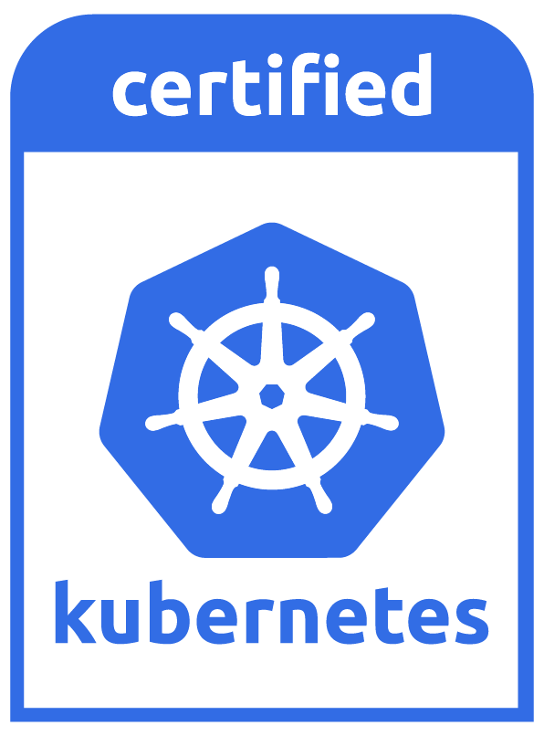

# About Our Managed Kubernetes
We provide a Hosted CNCF Certified Kubernetes Cluster tailored to your needs. Unlike self-service Kubernetes offerings, we take full responsibility for creating, updating, and managing your Kubernetes clusters. Once the cluster is set up, we provide you with a kubeconfig file that grants you secure access to the cluster.

# What We Manage for You
As part of our managed Kubernetes service, we handle the following tasks:

- Cluster Creation: We set up a Kubernetes cluster that meets CNCF certification standards, ensuring compatibility with the latest Kubernetes ecosystem.
- Cluster Updates: We regularly update the cluster to the latest stable version, ensuring security and performance enhancements.
- Cluster Management: We monitor the health and performance of the cluster control plane.

By managing these core elements, we enable you to focus on your applications without worrying about the operational complexities of Kubernetes.

In case anything goes wrong, you can reach us [here](/managedk8s/about/support/).
# Getting Started
## Step 1: Receive Your kubeconfig File
Once your Kubernetes cluster is ready, we will provide you with a kubeconfig file. This file contains the necessary credentials and connection details to access the cluster.

## Step 2: Install the kubectl Command-Line Tool
To interact with your managed Kubernetes cluster, you'll need to install kubectl, the Kubernetes command-line tool.

Installation Instructions:
- On macOS: brew install kubectl
- On Windows: Download the executable from Kubernetes Releases
- On Linux: Use the package manager for your distribution or download from Kubernetes Releases

## Step 3: Configure kubectl to Use the Provided kubeconfig
Once kubectl is installed, configure it to use the provided kubeconfig file:

Save the kubeconfig file in a secure location on your local machine.

Set the KUBECONFIG environment variable to point to the location of your kubeconfig file:
```bash 
export KUBECONFIG=/path/to/your/kubeconfig

# Verify the configuration by running:
# This command will display the details of your current Kubernetes configuration.
kubectl config view 
```

## Step 4: Access Your Cluster
You can now use kubectl commands to interact with your managed Kubernetes cluster. Here are some basic commands to get you started:

Check Cluster Nodes:

```bash 
kubectl get nodes
```
List Namespaces:

```bash 
kubectl get namespaces
```
Deploy Applications:

To deploy applications, create Kubernetes manifests (YAML files) defining your application configurations (Deployments, Services, etc.) and apply them to the cluster:


```bash 
kubectl apply -f your-deployment-file.yaml
```

## Certifications



Our managed kubernetes service is a product to efficiently set up and operate Kubernetes clusters on Wiit Cloud.
Customers can use a managed kubernetes cluster that pass the conformance checks and requirements by the
[Cloud Native Computing Foundation](https://cncf.io/ck).

Conformance results of our platform can be validated and checked at
[CNCF Kubernetes Conformance](https://github.com/cncf/k8s-conformance)