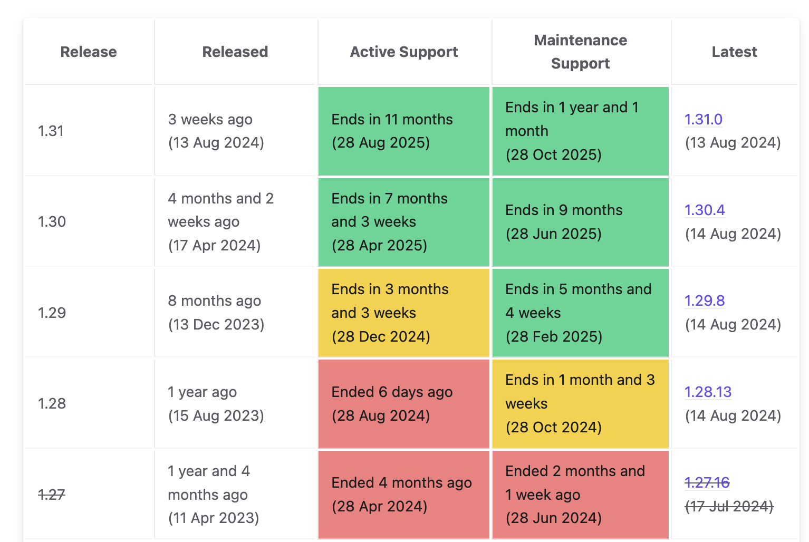

# Deprecation Policy

The upstream Kubernetes project releases approximately three Kubernetes versions a year and deprecates the same number of old versions.
Kubernetes follows an N-2 support policy (meaning that the 3 most recent minor versions receive security and bug fixes).

A good visualization of the support period for each release is available below:

Managed Kubernetes aligns loosely to this lifecycle by continuously introducing new versions and deprecating older ones.

After a given Kubernetes version has reached End-of-Life, it will not get any bugfixes or security updates. Hence, we cannot support it anymore either and have to deprecate it.

## Deprecation Process

If we decide to deprecate a specific Kubernetes version, we will notify you well in advance. The notification will include an End-of-Life announcement outlining the version's deprecation timeline. During that time you should plan and prepare for the upgrade of your cluster to a supported Kubernetes version before the deprecated version is removed.

You can find the list of supported Kubernetes versions and their planned End-of-Life dates [here](/gks/about/kubernetesversions/). A detailed documentation about how to upgrade clusters is available [here](../upgradingacluster/).

**What Does an End-of-Life Announcement Mean for Me?**

If an End-of-Life announcement has been made for a specific Kubernetes version, we suggest customers to contact us for upgrading their clusters to a newer version, preferably the latest one.

**What Happens If I Do Not Update Before the EOL Date?**

After the EOL period has ended:

- The EOL Kubernetes version will no longer be available in the managed service.
- Any clusters still running the EOL version will be automatically upgraded to a supported version.
- New clusters cannot be created with the EOL version.

**Can I Stay on an EOL Version Forever?**

No, as this would possibly mean serious security issues in the future.

## Force Upgrade Policy

If a Kubernetes version reaches End-of-Life, we have to remove its support from Managed Kubernetes since it will not receive any bugfixes or security updates anymore.

It is important to emphasize the following technical limitations in Kubernetes:

* A (control plane of a) Kubernetes cluster can be upgraded by one version at a time, e.g. from v1.30 -> v1.31.
* It is not possible to upgrade more than one versions at once.
* It is not possible to downgrade a cluster.

This means that if customers do not update their clusters before the removal of the **next** EOL version, they risk not being able to upgrade after the removal of the **next** deprecated version.

This would imply a serious problem as their only alternative would be to create a new cluster and migrate the workload from the old one as upgrading would not be possible (since it would require upgrading two versions at once).

To overcome this issue, we need to actively force customers to upgrade clusters running on an EOL Kubernetes version, before we remove the next deprecated version.

**What Happens to My Clusters During Force Upgrade?**

We will initiate an automated Kubernetes upgrade for the control plane and the Machine Deployment(s).

While this *should* work, it cannot be guaranteed to work, given the diversity of applications and use cases.

Breaking changes in the Kubernetes API can lead to broken/incompatible applications inside the Kubernetes cluster. **We can not overtake responsibility for such problems**.

To ensure optimal performance and security, we strongly advise all customers to keep their Kubernetes clusters up to date. Please contact us for executing your cluster upgrades.
