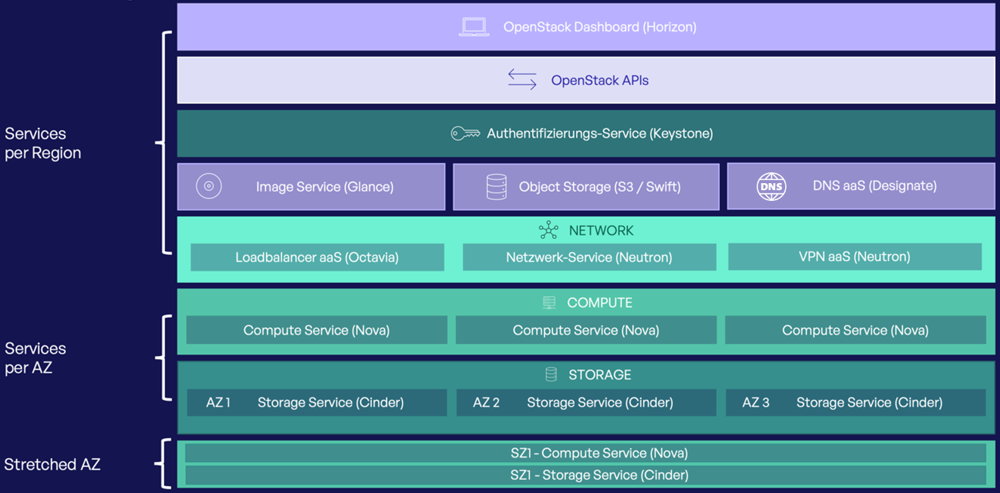

# Intro

## de-west-01 Region

Die OpenStack-Plattform der WIIT AG stellt Infrastrukturkomponenten im Self-Service-Modell als Infrastructure as a Service (IaaS) bereit.  
Ressourcen können entweder über die OpenStack-APIs oder das [OpenStack Dashboard](https://openstack.wiit-cloud.io/) verwaltet werden.

Aktuell steht die Plattform in der Region "de-west-01" (Standort: Düsseldorf) mit den folgenden Services zur Verfügung:

### Region Architektur


### Verfügbarkeitszonen

Die OpenStack-Services in der Region "de-west-01" sind auf drei Rechenzentren verteilt.  
Horizon, Keystone, Glance, Neutron, Octavia, Designate und der Object Storage werden von der WIIT AG standortübergreifend betrieben.  
Für Nova und Cinder werden die Rechenzentren als Verfügbarkeitszonen (AZ1, AZ2, AZ3) innerhalb von OpenStack abgebildet. Dadurch können Ressourcen gezielt über die physischen Standorte verteilt werden – mit dem Ziel einer optimalen Ausfallsicherheit.
Wird bei der Erstellung von Instanzen oder Volumes keine Verfügbarkeitszone angegeben werden diese automatisch in der Zone SZ1 erstellt.

### Stretched Zone (SZ1)

Zusätzlich zu den physischen Verfügbarkeitszonen stellt die WIIT AG eine „Stretched Zone“ (SZ1) bereit, die sich über alle Rechenzentrumsstandorte der Region erstreckt.  
Diese Zone ist ebenfalls in OpenStack als Verfügbarkeitszone auswählbar. Compute-Ressourcen, die in SZ1 erstellt werden, werden automatisch auf Hosts an allen drei Standorten verteilt.  
Bei einem Ausfall einer gesamten physischen Zone können diese Instanzen auf einem anderen Host innerhalb von SZ1 neu gestartet werden.

Neben dem Compute-Service stehen in der SZ1 auch Block-Storage-Volumes zur Verfügung. Daten, die auf Volumes in SZ1 gespeichert werden, sind über alle drei Rechenzentren hinweg redundant abgelegt.

**Wichtig:** Volumes können nur an Instanzen in derselben Verfügbarkeitszone angehängt werden – das gilt auch für SZ1. Volumes in SZ1 können daher ausschließlich mit Instanzen in SZ1 genutzt werden.

### Services & APIs

| **Service**                   | **API Endpoint**                                                                                                             |
|:------------------------------|:-----------------------------------------------------------------------------------------------------------------------------|
| Horizon (Dashboard)           | [https://openstack.wiit-cloud.io/](https://openstack.wiit-cloud.io/)                                                         |
| Keystone (Identity)           | [https://identity.openstack.de-west-01.wiit-cloud.io](https://identity.openstack.de-west-01.wiit-cloud.io)                   |
| Glance (Image Service)        | [https://image.openstack.de-west-01.wiit-cloud.io](https://image.openstack.de-west-01.wiit-cloud.io)                         |
| Nova (Compute Service)        | [https://compute.openstack.de-west-01.wiit-cloud.io](https://compute.openstack.de-west-01.wiit-cloud.io)                     |
| Neutron (Network Service)     | [https://network.openstack.de-west-01.wiit-cloud.io](https://network.openstack.de-west-01.wiit-cloud.io)                     |
| Cinder (Block Storage)        | [https://volume.openstack.de-west-01.wiit-cloud.io](https://volume.openstack.de-west-01.wiit-cloud.io)                       |
| Octavia (Load Balancer)       | [https://load-balancer.openstack.de-west-01.wiit-cloud.io](https://load-balancer.openstack.de-west-01.wiit-cloud.io)         |
| Designate (DNS Service)       | [https://dns.openstack.de-west-01.wiit-cloud.io](https://dns.openstack.de-west-01.wiit-cloud.io)                             |
| Object Storage / Swift        | [https://s3.openstack.de-west-01.wiit-cloud.io/swift](https://s3.openstack.de-west-01.wiit-cloud.io/swift/)                  |
| Object Storage / S3           | [https://s3.openstack.de-west-01.wiit-cloud.io](https://s3.openstack.de-west-01.wiit-cloud.io)                               |

## Service Status

Für transparente und zeitnahe Informationen über Wartungsarbeiten, Einschränkungen oder Störungen steht unsere [Statuspage](https://status.wiit-cloud.io) zur Verfügung.

Die folgenden Services auf der Statuspage sind relevant für die OpenStack-Plattform:  

- **de-west-01 OpenStack Services:** Verfügbarkeit des jeweiligen Dienstes
- **de-west-01 OpenStack APIs:** Verfügbarkeit der OpenStack APIs
- **de-west-01 OpenStack AZ1:** Verfügbarkeit von Compute, Storage und Netzwerk in AZ1
- **de-west-01 OpenStack AZ2:** Verfügbarkeit von Compute, Storage und Netzwerk in AZ2
- **de-west-01 OpenStack AZ3:** Verfügbarkeit von Compute, Storage und Netzwerk in AZ3
- **de-west-01 OpenStack SZ1:** Verfügbarkeit von Compute, Storage und Netzwerk in SZ1

## Wartungsarbeiten

Wartungsarbeiten an OpenStack-Services, durch die es zu Einschränkungen kommen kann, kündigen wir mit entsprechendem Vorlauf auf der [Statuspage](https://status.wiit-cloud.io) an.  
Dabei kann es zu kurzen Unterbrechungen der API-Zugriffe kommen – die Funktionalität bestehender Ressourcen bleibt unbeeinträchtigt (Loss of Control).

Wartungen an zonenspezifischen Services (Compute/Block Storage) werden nacheinander in den einzelnen AZs durchgeführt.  
Im Rahmen von Compute-Wartungen müssen Instanzen zwischen Compute Nodes verschoben werden. Die dazu notwendigen "Live Migrations" können in bestimmten Fällen zu kurzzeitigen Unterbrechungen der Instanzen führen.

## Support

Sollten Sie Fragen haben oder Probleme bei der Nutzung der OpenStack-Plattform feststellen, wenden Sie sich bitte an unseren Support: [helpdesk.de@wiit.one](mailto:helpdesk.de@wiit.one)

Um Rückfragen zu vermeiden und eine schnelle Bearbeitung zu ermöglichen, nutzen Sie bitte das folgende Template für Ihre Anfrage:

```
### OpenStack Issue Report

**Affected OpenStack Components:**  
(e.g. Glance, Nova, Neutron, ...)

**Project ID / Domain ID:**  
project_id:  
domain_id:  

**Problem Description:**  
(What happened?)

**Expected Behavior:**  
(What should have happened?)

**Steps to Reproduce:**  
1.  
2.  
3.  

**Actual Result / Error Output:**  
(Logs, error codes, tracebacks...)

**Timestamp and Region (if applicable):**  
(e.g. 2025-07-18 13:42 CEST / Region: de-west-01 / FRA?)

**Affected Resource IDs (optional):**  
(server_id=..., volume_id=...)

**Were any workarounds or tests attempted?**  
- [ ] Yes (please describe below)  
- [ ] No

**Priority:**  
- [ ] Critical (Production impact)
- [ ] High
- [ ] Medium
- [ ] Low

**Attachments:**
(Logs, screenshots, `openstack --debug` output, API dumps...)

```
