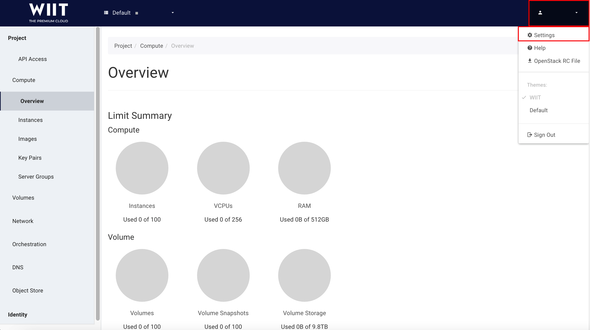

Das Dashboard (Horizon)
===================================================================

Login
-----

Nachdem die Zugangsdaten durch einen User mit der Manager Rolle erstellt wurden, ist der nächste Schritt die Anmeldung im Dashboard.

**WICHTIG:** Manager User können Ihr Passwort zurücksetzen sollten Sie ein neues Passwort benötigen.

Das Dashboard erreichen Sie unter: <https://openstack.wiit-cloud.io/>

Im sich öffnenden Fenster tragen Sie bei Domain *Ihre Domain Nummer* ein und tragen den Benutzernamen sowie das zugehörige Passwort ein.

Nun öffnet sich das Horizon(Dashboard).

Passwort ändern
---------------

Da aus Sicherheitsgründen empfohlen wird das Passwort nach Erhalt zu
ändern, klicken wir im Horizon(Dashboard) dafür rechts oben auf den
Benutzernamen(1) und auf *Settings*(2).

Im sich nun öffnenden Fenster sehen wir zuerst Settings, wo unter
anderem auch die Sprache umgestellt werden kann.

Um das Passwort zu ändern, klicken wir rechts auf *Change Password*(1).
Hier können nun das Passwort geändert werden. Dafür geben wir zunächst
unser bisheriges Passwort ein(2), geben dann das neue an(3) und
bestätigen es in der neuen Zeile (4).

Damit das neue Passwort auch übernommen wird, fehlt noch ein Klick auf
*Change*(5).

