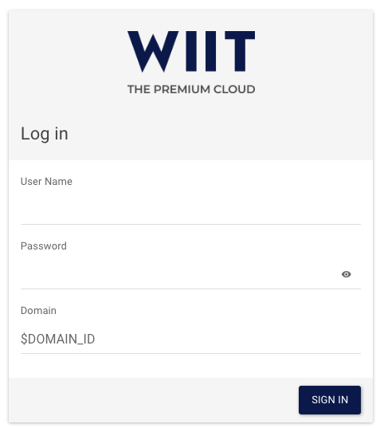
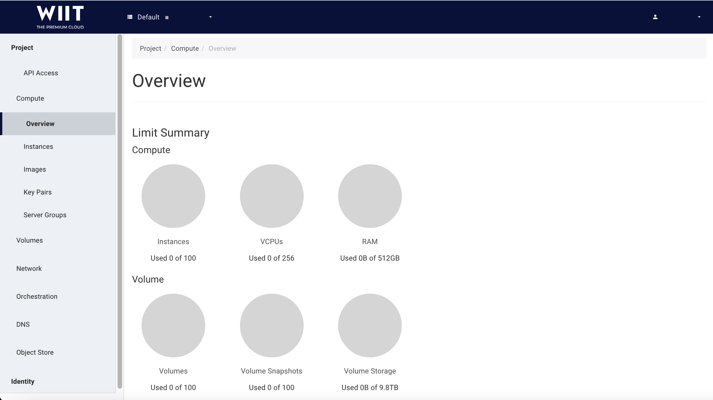
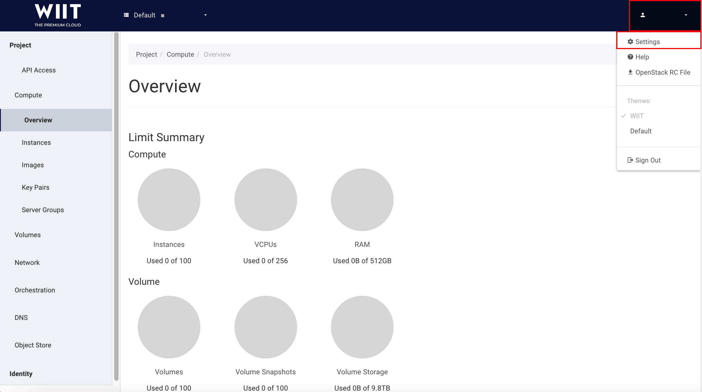
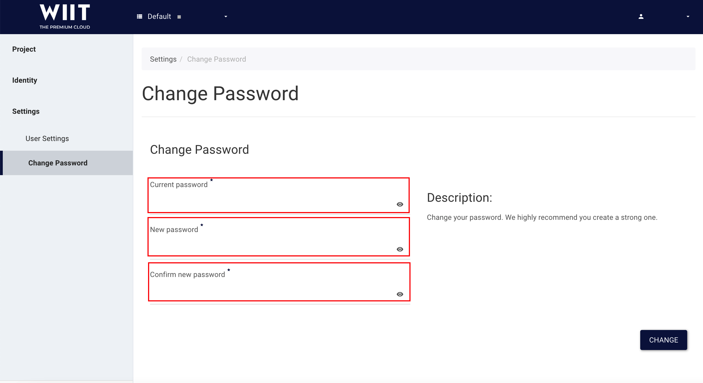

Das Dashboard (Horizon)
===================================================================

Login
-----

After the creadentials have been created from a user with the manager role in your domain you can log on to the dashboard.

**IMPORTANT**: Manager Users are also able to reset your password in case you need a new password.  

The URL for the dashboard is: <https://openstack.wiit-cloud.io>

The login form appears. Use *your Domain Number* for the *Domain* field, and enter
your user name and password in the relevant fields.

Change Password
---------------

For security reasons we recommend changing your password after
receiving it from WIIT.

To change the password, click your *User name* (1) in right corner of
 Horizon and then *Settings* (2).

The Settings window appears, where you can change various
settings.

To change the password, click *Change Password*
 (1) in the left-side navigation menu. Enter your old password (2), then enter the new
one (3), and confirm the new one (4).

To save it, click *Change* (5).

